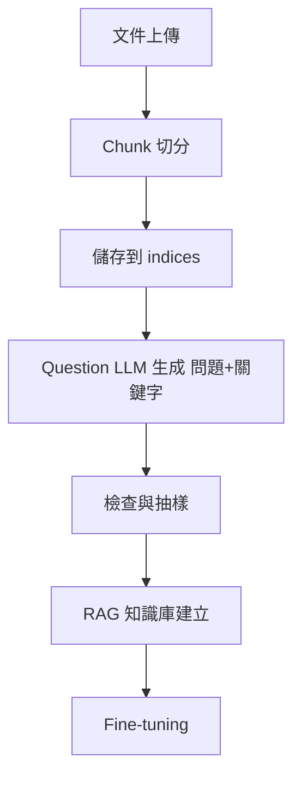

# Multilingual RAG Live2D Scaffold – 全流程模組

## 1. 專案簡介
本專案是一個 **可移植的多語言 RAG（Retrieval-Augmented Generation）資料處理與問答系統**，可從原始文件自動完成：

1. **Chunk 切分**（將大文件切成可用的片段）
2. **Question LLM 問題與關鍵字生成**
3. **問題檢查與抽樣**
4. **RAG 知識庫構建**
5. **Fine-tuning 微調**（可選）
6. 支援 **MOCK 測試** 與 **連接本地/雲端 LLM**

---

## 2. 系統架構



---

## 3. 環境建置

### 3.1 Python 虛擬環境
```bash
# 建立並啟用虛擬環境
python -m venv .venv
source .venv/bin/activate   # Linux/Mac
.venv\Scripts\activate      # Windows PowerShell

# 安裝依賴
pip install -r requirements.txt
```

### 3.2 Docker（可攜式部署）
若需將完整系統打包到公司/客戶端：
```bash
docker build -t rag-pipeline .
docker run -it --rm -v $(pwd):/app rag-pipeline
```

---

## 4. 運行模式設定

系統支援 **MOCK 模式**（不連網、回傳範例 JSON）與 **OPENAI_COMPAT 模式**（連接本地或雲端 LLM）。

### 4.1 環境變數設定
```bash
# MOCK 模式（測試用）
export LLM_MODE=MOCK

# OpenAI 相容模式（例如 Ollama, OpenWebUI, OpenAI）
export LLM_MODE=OPENAI_COMPAT
export OPENAI_BASE_URL=http://localhost:11434/v1
export OPENAI_API_KEY=sk-xxx
export MODEL_QUESTION=llama3.2:8b-instruct
```

Windows PowerShell：
```powershell
$env:LLM_MODE="OPENAI_COMPAT"
$env:OPENAI_BASE_URL="http://localhost:11434/v1"
$env:OPENAI_API_KEY="sk-xxx"
$env:MODEL_QUESTION="llama3.2:8b-instruct"
```

---

## 5. 資料準備

將處理後的 chunk 存放於：
```
indices/
  ├── chunks.txt
  └── metadata.json   # 可選
```

`chunks.txt` 支援多種格式：
- JSONL
- TSV (`source \t page \t text`)
- PIPE (`source ||| page ||| text`)
- BLOCK (`[source | page N]` + 多行內容)

---

## 6. Chunk 切分與儲存

如果你還沒有 chunk，可以先用切分工具（自行撰寫或整合 pdfminer/pymupdf 等工具）將 PDF/Word/Text 切分成結構化的 chunks，並存成 `chunks.txt`。

---

## 7. 問題生成

```bash
# 生成問題
python -m packages.rag.generation.Question_llm.make_questions   --index indices   --out data/questions.jsonl   --langs zh,en   --max-chunks 50
```

輸出範例（單行 JSON）：
```json
{
  "chunk_id": 0,
  "source": "example.pdf",
  "page": 1,
  "keywords": ["AI", "cloud", "automation"],
  "questions": [
    {"text": "Summarize the main topic...", "lang": "en", "difficulty": "easy", "topic": "overview"}
  ],
  "preview": "This is the chunk content preview..."
}
```

---

## 8. 問題檢查

```bash
python scripts/check_questions.py data/questions.jsonl
```
輸出：
```
lines=705, OK=705, BAD=0
```

---

## 9. 抽樣檢查

```bash
python scripts/sample_questions.py
```
會隨機抽取 20 題問題檢視。

---

## 10. 關鍵字生成（進階）

- 預設 MOCK 模式會用固定的 `keyword_one`, `keyword_two`, `keyword_three`
- 若要用本地 LLaMA 產生真實關鍵字，需啟用 **OPENAI_COMPAT** 模式並修改 `llm_clients.py`

---

## 11. RAG 建立與 Fine-tuning

1. 將 `questions.jsonl` 與對應答案整理成 QA 資料集
2. 建立向量資料庫（FAISS, Milvus, Weaviate, Pinecone...）
3. 使用該資料庫與模型搭配 RAG Pipeline
4. （可選）對模型進行 fine-tuning

---

## 12. 容器化部署

若要將整個流程打包給客戶：
```bash
docker build -t rag-module .
docker save rag-module -o rag-module.tar
# 到客戶端後
docker load -i rag-module.tar
```

---

## 13. 技能地圖

- **LLM 提示工程（Prompt Engineering）**
- **資料處理與切分（Chunking）**
- **RAG 知識檢索架構**
- **模型微調（Fine-tuning）**
- **系統容器化（Docker）**
- **API 整合與部署**
